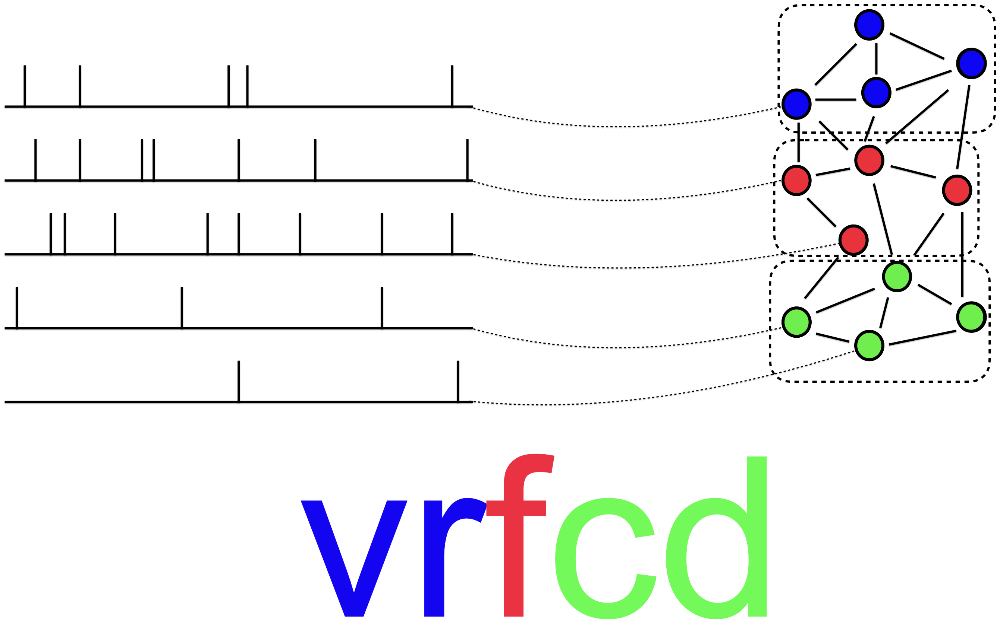
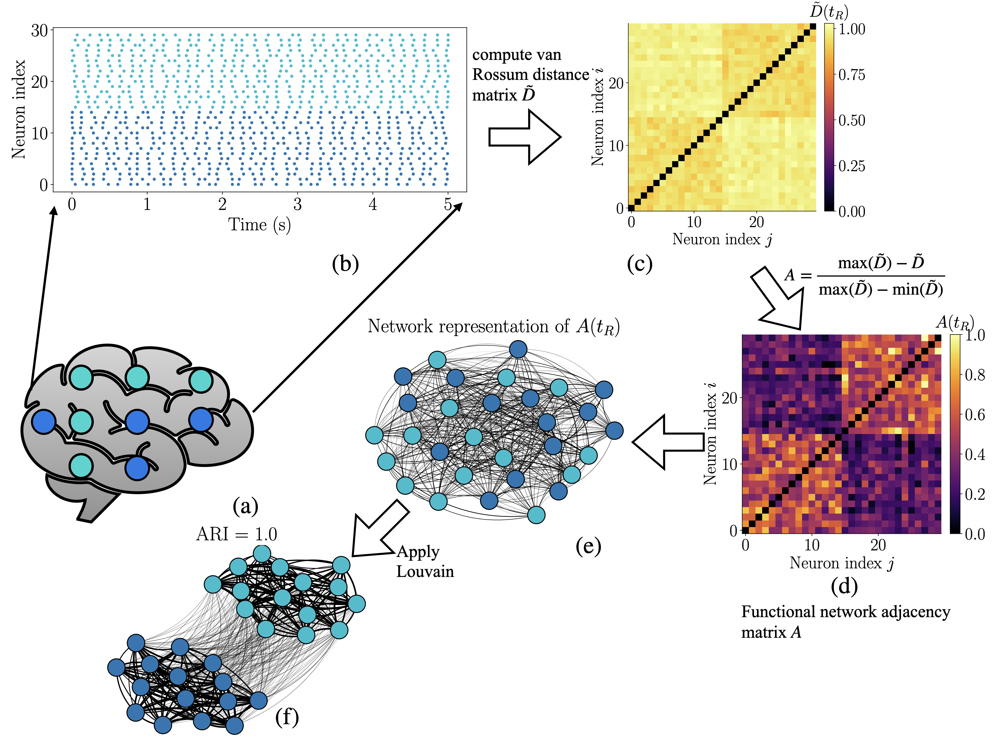

# vrfcd



`vrfcd` stands for **van Rossum Functional Community Detection**.

This is a `Python` package for constructing functional connectivity networks from neural spike-train data
using the van Rossum distance, and then detecting functional assemblies in the resulting weighted network.
The package is designed for computational neuroscience workflows where the input data are spike rasters.
The goal is to identify groups of neurons with similar temporal spiking structure.

## Workflow


Given a ```spike train``` as input the workflow is a four step process:
```
- Compute the van Rossum distance matrix
- Transform it into functional adjacency matrix
- Prepare the weighted `networkX` graph
- Perform community detection on the graph
```

## Features
`vrfcd` provides tools to:

- compute a normalised van Rossum distance matrix from spike-train raster datasets,
- convert the distance matrix into a functional adjacency matrix using different similarity transformations,
- construct a weighted functional graph from the adjacency matrix,
- detect communitues using either the Louvain or Leiden community detection algorithm,
- visualise the distance matrix, functional matrix, and network representation, and
- run the full analysis using a single pipeline interface.


## Installation

```bash
pip install vrfcd
```

For development:

```bash
git clone https://github.com/indranilg49/vrfcd.git
cd vrfcd
pip install -e ".[dev]"
```

For optional Leiden community detection:

```bash
pip install -e ".[dev,leiden]"
```

## Simple usage

```bash
import numpy as np
from vrfcd import VRFCDPipeline

pipeline = VRFCDPipeline( t_R=0.01, kernel="minmax", community_method="louvain", n_jobs=4, )

result = pipeline.fit(spike_matrix, t_axis)

D = result.D
A = result.A
G = result.G

partition = result.partition
```

Here `spike_matrix` should have the shape of `n_neurons x n_time_bins`, and `t_axis` should be the corresponding
time axis. Note that if the time axis comes from experimental data with absolute time stamps, it is a good idea
to rescale it so that it starts at zero:

```bash
t_axis = t_axis - t_axis[0]
```

## Main functions

- ```compute_van_rossum_distance```

```bash
from vrfcd import compute_van_rossum_distance
```

This computes the pairwise van Rossum distance matrix between spike trains.

```bash
D = compute_van_rossum_distance(
    spike_matrix,
    t_axis,
    t_R=0.01,
    traces=False,
    n_jobs=4,
)
```

The parameter `t_R` controls the time scale of the exponential filter used in the van Rossum distance.
Smaller values of `t_R` make the distance more sensitive to precise spike timing, while larger values smooth
spike trains over a longer temporal window.

If `traces=True`, the function also returns the convolved spike-train waveforms:

```bash
D, waveforms = compute_van_rossum_distance( spike_matrix, t_axis, t_R=0.01, traces=True, )
```

- ```distance_to_functional_matrix```

```bash
from vrfcd import distance_to_functional_matrix
```

This converts the van Rossum distance matrix into a functional adjacency matrix.

```bash
A = distance_to_functional_matrix( D, kernel="minmax", )
```

This package currently supports three similarity transformations.

```kernel = "clipping"```

When using this, the distances are capped at 1 and converted to similarities using: A = 1-D.

```kernel = "exponential"```

When using this, the distances are rescaled using an exponential kernel: A = exp(-D/beta). The parameter
`beta` controls how quickly similarity decays with distance.

```bash
A = distance_to_functional_matrix( D, kernel="exponential", beta=0.1, )
```

```kernel = "minmax"```

When using this, the distances are rescaled using a min-max transformation:

```bash
A = distance_to_functional_matrix(
    D,
    kernel="minmax",
    q_low=0.0,
    q_high=1.0,
)
```

This maps small distances to high functional similarity and large distances to low functional similarity. 
The diagonal of the resulting matrix is set to 0 by default.

- ```build_functional_graph```

```bash
from vrfcd import build_functional_graph
```

This builds a weighted `networkX` graph from the functional adjacency matrix.

```bash
G = build_functional_graph( A, threshold=0.0, )
```

In the graph representation, each neuron is a node, and edges are weighted by the functional similarity values
in `A`. The `threshold` parameter can be used to remove weak functional connections.

- ```detect_communities```

```bash
from vrfcd import detect_communities
```

This function detects communities in the weighted functional graph.

```bash
partition = detect_communities( G, method="louvain", seed=42, )
```

The output is a disctionary mapping each node to a community label. The package currently supports two 
methods for community detection:

```bash
method = "louvain"
method = "leiden"
```

The Louvain method works with the core dependencies. In order to use Leiden, you will need to install the optional dependencies
`igraph` and `leidenalg` additionally.

## Pipeline interface

Here we outline the easiest way to use the package through `VRFCDPipeline`.

```bash
from vrfcd import VRFCDPipeline 

pipeline = VRFCDPipeline( t_R=0.01, kernel="minmax", q_low=0.0, q_high=1.0, community_method="louvain", n_jobs=4, traces=True, )

result = pipeline.fit(spike_matrix, t_axis)
```

The pipeline returns a `VRFCDResult` object containing:

- `result.D`: van Rossum distance matrix
- `result.A`: functional adjacency matrix
- `result.G`: community labels
- `result.partition`: graph with community attributes
- `result.G_partitioned`: van Rossum distance matrix
- `result.counts`: number of nodes in each community
- `result.waveforms`: convolved spike traces, if `traces=True`

This allows the full analysis to be run in one step while still giving access to every intermediate object.

## Plotting

`vrfcd` also includes helper functions for viusalisation.

```bash
from vrfcd.plotting import plot_matrix, plot_functional_network
```

To plot the van Rossum distance matrix:

```bash
plot_matrix( result.D, colorbar_title=r"$\tilde{D}(t_R)$", savepath="distance_matrix.pdf", )
```

To plot the adjacency matrix:

```bash
plot_matrix( result.A, colorbar_title=r"$A(t_R)$", savepath="functional_matrix.pdf", )
```

To plot the functional network:

```bash
plot_functional_network( result.G_partitioned, partition=result.partition, savepath="functional_network.pdf", )
```

## Overview

This package is intended for exploratory and research-focused analysis of spike-train data. It is particularly useful when 
one wants to compare neurons based on spike timing, construct a functional network from these similarities,
and identify groups of neurons with similar temporal spiking patterns. This package can be used with synthetic spike raster,
simulated spiking network models, and experimental recordings such as Neuropixels spike-train datasets.


